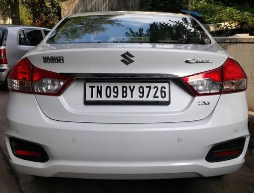

# CSE411 — Computer Vision

## Task-6: GeoManJi 75% Project Implementation Report

### Team-24

| University ID | Student name     |
| ------------- | ---------------- |
| 2023BCD0061   | J Glen Enosh     |
| 2023BCS0007   | Vijay Venkat J   |
| 2023BCS0040   | Jayanth P        |
| 2023BCS0220   | G Srishtik Sekar |

**Project:** GeoManJi — Evidence-Based Visual Geolocation and Travel Assistance  
**Submission date:** 2 October 2026  
**Current status:** Approximately 75% of the proposed project has been implemented
as a working integrated prototype.

---

## 1. Project overview and current status

The project has reached approximately 75% overall implementation. The core
architecture is in place, and the primary functional blocks have been
implemented: image geolocation, OCR processing, evidence-based geographic
inference, India-only candidate selection, and the probabilistic geolocation
model based on the research paper _Around the World in 80 Timesteps: A
Generative Approach to Global Visual Geolocation_.

The remaining effort is concentrated on validation, performance tuning,
robustness improvements, destination recommendation, and travel routing.

GeoManJi accepts a street, landmark, or travel photograph and produces an
evidence-backed location analysis. The completed product is intended to:

1. read visible text and local-language clues;
2. infer visually similar places rather than relying on text alone;
3. constrain the requested result set to India;
4. show the best five candidates as map pins;
5. turn the selected candidate into useful travel destinations and an efficient
   route/itinerary.

Items 1–4 now operate as an integrated prototype. Item 5 and production
hardening make up the remaining 25%.

## 2. Completed work (approximately 75%)

| Work package                        |  Weight | Status                | Current result                                                                                              |
| ----------------------------------- | ------: | --------------------- | ----------------------------------------------------------------------------------------------------------- |
| Upload/API and image handling       |     10% | Complete              | `POST /geolocate` accepts an image and returns one JSON result.                                             |
| Gemini OCR and location evidence    |     15% | Complete              | Text, languages, scripts, bounding boxes, clues, likely area, and supporting evidence are returned.         |
| Visual geolocation integration      |     20% | Complete              | Existing GeoCLIP prediction and the new PLONK OSV-5M generative prediction run in the same request.         |
| India-only top-five ranking         |     15% | Complete              | PLONK samples are country-filtered, density-clustered, ranked, and exposed as `similar_places`.             |
| OpenStreetMap presentation          |     10% | Complete              | `/map` uploads an image and renders numbered candidate pins with popups and result cards.                   |
| Integration tests and documentation |      5% | Complete              | India boundary, clustering, service contract, OSM links, setup, configuration, and limitations are covered. |
| **Total completed**                 | **75%** | **Working prototype** | End-to-end module integration is present; real inference requires model weights/API access.                 |

## 3. Implemented modules

### 3.1 API entry point and request flow

`main.py` exposes the FastAPI application. Its primary endpoint,
`POST /geolocate`, accepts an uploaded image, copies it into a temporary file,
and passes that file through the integrated prediction pipeline. Long-running
inference is moved to a worker thread so the web server's event loop remains
responsive.

The API also exposes:

- `GET /` for service health and links;
- `GET /docs` for the generated OpenAPI interface;
- `GET /map` for the interactive OpenStreetMap result view.

The model wrapper is initialized lazily on the first inference request. This
allows the health check, documentation, and map page to start without first
waiting for GeoCLIP and PLONK model weights to load.

### 3.2 GeoCLIP integration

`src/geoclip/geotag.py` wraps GeoCLIP and provides:

- `predict()` for the raw latitude, longitude, and model probability;
- `predict_with_evidence()` for the combined GeoCLIP, OCR, Gemini, PLONK, and map
  response.

The method preserves the original GeoCLIP result while adding language evidence,
area clues, five similar places, PLONK sampling metadata, and map-ready objects.
This keeps the response backward-compatible with the earlier project stage.

### 3.3 OCR pipeline

`src/ocr/pipeline.py` implements the OCR normalization and evidence flow. It:

- normalizes detected text and bounding boxes;
- filters detections below the configured confidence;
- reconstructs text in reading order;
- aggregates language and script information;
- produces structured geographic clue objects;
- detects Indian and other writing systems through Unicode ranges when needed;
- falls back safely when Gemini analysis is missing or empty.

### 3.4 Gemini-based contextual analysis

`src/ocr/gemini.py` sends the uploaded image to Gemini using a structured JSON
schema. Gemini is asked to transcribe visible text, identify languages/scripts,
extract place-related clues, estimate a likely area only when supported by
visible evidence, and return the exact supporting text.

The module includes API timeouts, bounded retries for transient errors, response
validation, image-size checks, and graceful error reporting. A missing API key or
invalid Gemini response does not prevent GeoCLIP or PLONK processing.

### 3.5 Data models and contracts

`src/ocr/models.py` defines the schemas for OCR detections, language information,
location clues, Gemini results, and the combined location prediction.

`src/plonk_india/models.py` adds explicit schemas for ranked similar places and
PLONK inference metadata. Together these models establish a stable interface
between OCR, Gemini, GeoCLIP, PLONK, the API, and the map client.

### 3.6 PLONK probability model

`src/plonk_india/service.py` integrates `diff-plonk==0.4` and the
`nicolas-dufour/PLONK_OSV_5M` checkpoint. PLONK generates multiple possible
coordinates from the visual content instead of forcing the image into a single
point prediction. The service loads and caches the model only when it is first
needed.

`src/plonk_india/india.py` implements the India boundary filter, geodesic
distance calculation, density grouping, medoid selection, and top-five ranking.
`src/plonk_india/nominatim.py` converts the selected coordinates into readable
place/state labels through OpenStreetMap Nominatim.

### 3.7 OpenStreetMap result interface

`src/web/map.html` provides the working visual prototype. A user can upload an
image, submit it to `/geolocate`, and view the returned candidates as numbered
pins. The page shows the locality, state, coordinate, India sample share,
OCR-match indicator, and a direct OpenStreetMap link for each candidate.

## 4. Integrated implementation details

### 4.1 Integrated inference flow

```text
Uploaded image
   ├── GeoCLIP ───────────────> best global coordinate + model probability
   ├── Gemini image analysis ─> OCR, language, script, place clues + evidence
   └── PLONK OSV-5M ──────────> 1,024 stochastic global coordinate samples
                                      │
                                      v
                              India polygon/island filter
                                      │
                                      v
                              125 km density clusters
                                      │
                                      v
                              top five medoid coordinates
                                      │
                           Nominatim labels + OCR agreement
                                      │
                                      v
                         numbered Leaflet/OpenStreetMap pins
```

The three inference branches address different evidence:

- GeoCLIP preserves the original single-coordinate baseline.
- Gemini provides explainable text/language evidence and remains non-fatal when
  its API is not configured or unavailable.
- PLONK models uncertainty by sampling multiple plausible coordinates. Its
  `PLONK_OSV_5M` checkpoint is selected because the input use case is primarily
  street-view-like imagery.

### 4.2 PLONK integration

The upstream `diff-plonk==0.4` package is now a project dependency. The pipeline
is constructed lazily on the first inference and then cached, preventing model
startup cost on every request. The default call is equivalent to:

```python
pipeline(image, batch_size=1024, cfg=0.0, num_steps=32)
```

The upstream package pins SciPy 1.13.1, for which the current Python 3.13
environment has no compatible wheel. `pyproject.toml` therefore contains a UV
override to use SciPy 1.16 or newer. PLONK uses stable SciPy interfaces in this
inference path, but a real-checkpoint smoke test is still required whenever the
PLONK or SciPy version is upgraded.

### 4.3 India-only behavior

PLONK does not expose a native `country=India` generation parameter. The system
implements a strict result constraint after generation:

1. discard invalid/non-finite coordinates;
2. retain points within a Natural Earth-derived mainland India polygon;
3. separately retain the Lakshadweep and Andaman/Nicobar island ranges;
4. group points within a configurable radius (125 km by default);
5. rank groups by the number of supporting samples;
6. use the observed medoid of each group as its pin, avoiding a mean coordinate
   drifting into the sea or over a border;
7. promote a candidate when its Nominatim place/state has an explicit match in
   the Gemini OCR text, area guess, or structured clue values;
8. return no more than five modes.

This makes every returned pin pass the prototype's India mask. It does **not**
claim that PLONK itself is India-conditioned. If it produces fewer than five
distinct samples/modes inside India, the API returns fewer results and reports
the reason instead of inventing places.

`sample_share` is calculated as:

```text
samples in this cluster / all PLONK samples retained inside India
```

It is useful for relative ordering but must not be presented as a calibrated
probability of the real location.

### 4.4 Place labels and map

Each selected coordinate is reverse-geocoded through the public OpenStreetMap
Nominatim endpoint. Requests carry a configurable identifying user agent and are
paced at approximately one request per second. Failed lookups do not fail image
inference; the coordinate receives a neutral `India candidate N` label.

The `/map` page uses Leaflet and official OpenStreetMap tiles. It:

- uploads the image to the existing FastAPI endpoint;
- reads `similar_places` from the response;
- creates numbered pins 1–5;
- fits the map to the result bounds;
- shows the locality, state, coordinate, and sample share;
- links each result to its corresponding openstreetmap.org page.

OpenStreetView-5M is the dataset used to train the selected PLONK checkpoint;
OpenStreetMap is the map shown to the user. They are related names but distinct
components.

### 4.5 API additions

The existing response remains backward-compatible and now adds:

```json
{
  "similar_places": [
    {
      "rank": 1,
      "name": "Bengaluru",
      "display_name": "Bengaluru, Karnataka, India",
      "latitude": 12.9716,
      "longitude": 77.5946,
      "sample_share": 0.375,
      "supporting_samples": 3,
      "evidence_match": true,
      "ranking_reason": "PLONK sample density plus OCR/Gemini place agreement",
      "map_url": "https://www.openstreetmap.org/?mlat=12.971600&mlon=77.594600#map=12/12.971600/77.594600"
    }
  ],
  "plonk": {
    "source": "plonk",
    "model": "nicolas-dufour/PLONK_OSV_5M",
    "country_filter": "India",
    "requested_samples": 1024,
    "generated_samples": 1024,
    "india_samples": 148,
    "india_sample_share": 0.1445,
    "error": null
  },
  "map": {
    "provider": "OpenStreetMap",
    "locations": ["same five structured place objects"]
  }
}
```

The numerical values above illustrate the response contract; actual values
depend on the uploaded image and stochastic PLONK samples.

## 5. Demonstration and verified results

### 5.1 Example input

The following sample represents the type of picturesque landmark image collected
from social-media or web sources for development testing:


The same endpoint can process street scenes and text-rich photographs such as a
vehicle registration image. These inputs allow OCR/location evidence and visual
geolocation to be evaluated together:



### 5.2 Output obtained from the current prototype

For an uploaded image, the current integrated output contains:

- GeoCLIP latitude, longitude, and probability;
- Gemini OCR text, languages, scripts, area guess, and evidence;
- up to five India-only PLONK candidate locations;
- sample support and relative share for each candidate;
- an indication when the candidate label agrees with OCR/Gemini evidence;
- a human-readable OpenStreetMap/Nominatim place label;
- up to five map-ready coordinates and direct OpenStreetMap links.

The interactive output is available through `/map`, where the locations appear
as numbered pins. The JSON contract produced by the API is shown in Section 4.5.

### 5.3 Controlled integration result

The deterministic integration fixture supplied nine generated coordinates:
three around Bengaluru, two around Mumbai, one each around Delhi, Kolkata and
Chennai, and one in Kathmandu. The verified behavior was:

```text
Generated samples:       9
Samples retained:        8
Non-India samples:       Kathmandu removed
Ranked India modes:      5
Strongest mode support:  3 samples
Second mode support:     2 samples
OSM links generated:     5
India check on all pins: passed
```

Test command and result:

```text
$ python -m unittest discover -s tests -v
test_filter_keeps_mainland_and_islands ... ok
test_modes_are_ranked_by_support ... ok
test_ocr_place_agreement_promotes_a_candidate ... ok
test_service_returns_five_india_map_pins ... ok

Ran 4 tests
OK
```

Python compilation also completes for `main.py`, `src`, and `tests`. The unit and
integration boundary is deliberate: the test substitutes deterministic PLONK
samples and place labels, so it verifies our filter/ranking/API code without
downloading a large model or calling a rate-limited public service. Full model
quality still requires the evaluation described in the remaining work.

Additional environment checks completed successfully:

```text
PLONK package import:       PlonkPipeline available
Dependency lock:           122 packages resolved; lock is current
GET / health route:        200 OK
GET /map route:            200 OK, OpenStreetMap page served
Live reverse-geocode:      Bengaluru, Karnataka, India
```

## 6. How to run the current prototype

```bash
uv sync
export GEMINI_API_KEY="your-key"
export NOMINATIM_USER_AGENT="GeoManJi/0.1 your-contact@example.com"
uv run uvicorn main:app --reload
```

Then open `http://127.0.0.1:8000/map`, select an image, and choose **Find five
places**. The first PLONK request downloads checkpoint assets and can take several
minutes. CUDA is strongly recommended.

API-only demonstration:

```bash
curl -X POST http://127.0.0.1:8000/geolocate \
  -F "img=@src/sample_data/img2.png"
```

## 7. Remaining work (25%)

The remaining work is majorly travel-destination and routing based, as proposed.
The following split is firm and measurable.

### A. Destination enrichment and recommendation — 10%

- For each of the five candidate areas, retrieve attractions, food, lodging,
  opening hours, categories, and accessibility metadata from an approved POI
  source.
- Rank destinations using candidate confidence, user interests, travel dates,
  popularity, distance, and opening status.
- Add a candidate confirmation step so itinerary generation begins from the
  location the user actually chooses rather than an uncertain model guess.
- Return explainable recommendations (for example, “near candidate 1 and open on
  Saturday”), not only a list of POIs.

Acceptance criterion: selecting one candidate produces at least five deduplicated
destinations with source attribution, coordinates, hours where available, and a
human-readable reason for each ranking.

### B. Routing and itinerary construction — 10%

- Integrate a routing engine such as self-hosted OSRM, Valhalla, or GraphHopper;
  do not depend on the public OSM tile server for routing.
- Support driving, walking, and cycling where the chosen engine has coverage.
- Build a route from the confirmed start through selected destinations, including
  ordered stops, per-leg distance/time, total distance/time, and route geometry.
- Draw the route polyline and stop order on the existing map.
- Handle unreachable stops, time windows, and route-engine timeouts explicitly.

Acceptance criterion: a user can choose a candidate and at least two destinations,
receive a valid ordered route, and see its polyline plus distance/duration on the
map.

### C. Production quality, evaluation, and deployment — 5%

- Run a labelled India image benchmark and report top-1/top-5 distance accuracy,
  India-sample recall, latency, GPU memory, and failure rate.
- Replace the simplified boundary with a versioned, licensed authoritative
  multipolygon and define the disputed-boundary policy with the product owner.
- Add model warm-up, bounded request queues, upload size/type validation, result
  caching, structured telemetry, and concurrency/load tests.
- Self-host or use a contract-backed geocoder/tile provider before meaningful
  traffic; the public Nominatim/tile services are appropriate only for this
  low-volume prototype.
- Add browser tests for `/map` and a checkpoint-backed smoke test in a GPU-capable
  environment.

Acceptance criterion: the benchmark and operational limits are published, a
containerized deployment passes health/smoke/load checks, and third-party service
usage complies with its production policy.

## 8. Known limitations and engineering decisions

- Visual resemblance is probabilistic; it does not prove the photograph was
  taken at a returned place.
- PLONK results vary between calls unless a reproducible sampling seed is added.
- Very low India sample count is an uncertainty signal. The system exposes it and
  does not silently fill missing candidates.
- Nominatim labels can be absent or approximate, but coordinates and pins remain
  available.
- OCR/Gemini and the vision models are currently run sequentially, so latency is
  the sum of their inference times. Safe GPU scheduling and concurrency are part
  of production hardening.
- The current map is a location-comparison interface, not yet a trip planner. The
  destination recommendation and routing packages above are the principal 25%
  still to be completed.

## 9. Conclusion

GeoManJi has progressed from separate experimental scripts into an integrated
computer-vision prototype. Image upload, GeoCLIP prediction, Gemini OCR,
language/script evidence, PLONK probabilistic sampling, India-only top-five
selection, reverse geocoding, structured JSON output, and OpenStreetMap pins are
now connected in a single request flow.

This represents approximately 75% of the proposed work. The major remaining 25%
is the travel layer: validating model quality on a labelled India dataset,
turning the confirmed location into useful destination recommendations, and
constructing a route/itinerary across the selected destinations. These remaining
tasks have measurable acceptance criteria in Section 7 and can be implemented
without redesigning the completed core architecture.

## 10. References

1. Nicolas Dufour, David Picard, Vicky Kalogeiton, and Loic Landrieu, _Around
   the World in 80 Timesteps: A Generative Approach to Global Visual
   Geolocation_, arXiv:2412.06781, 2024.
2. PLONK source repository: <https://github.com/nicolas-dufour/plonk>
3. GeoCLIP package/project used for baseline coordinate prediction.
4. Google Gemini API used for structured OCR and contextual evidence analysis.
5. OpenStreetMap, Nominatim, and Leaflet used for place labels and map
   visualization.
